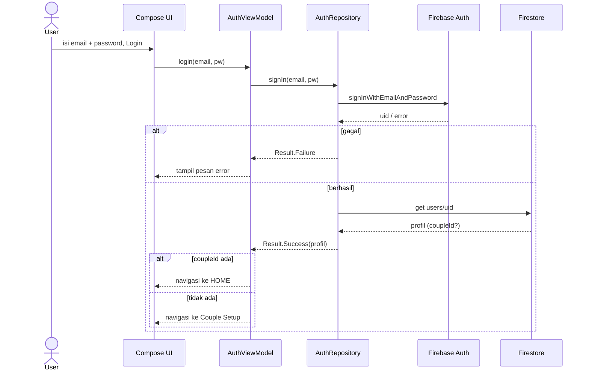
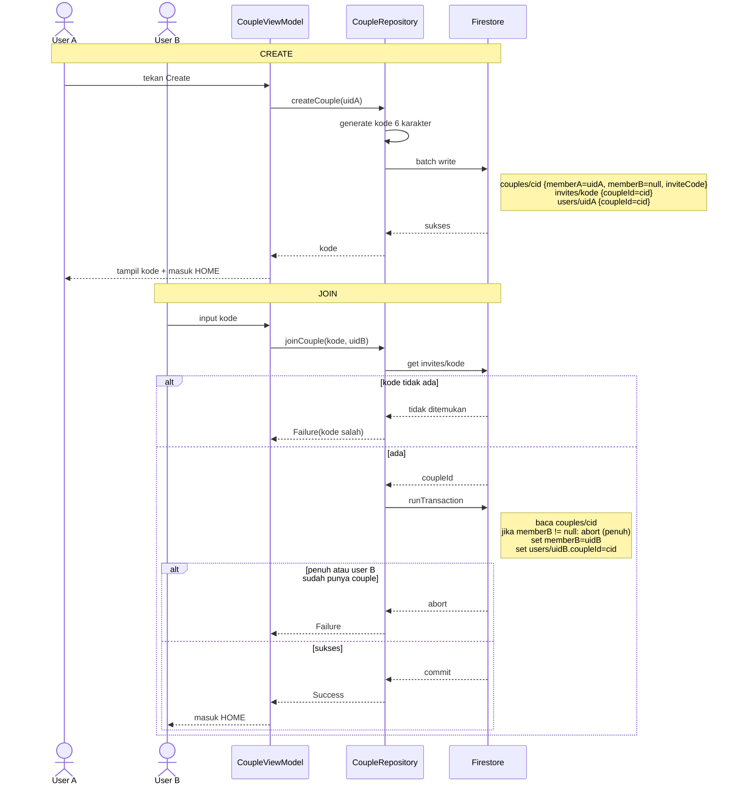
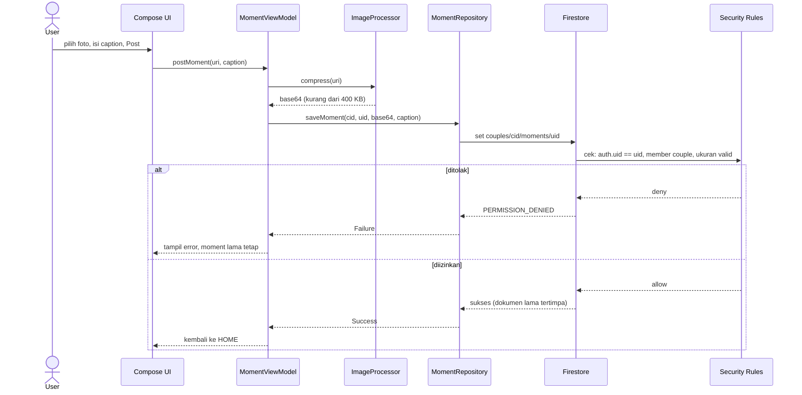
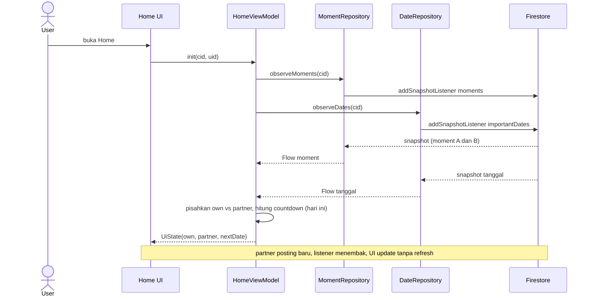

# 05 — Sequence Diagram

## SD-01 Login dan layar awal

```mermaid
sequenceDiagram
    actor U as User
    participant UI as Compose UI
    participant VM as AuthViewModel
    participant R as AuthRepository
    participant FA as Firebase Auth
    participant FS as Firestore
    U->>UI: isi email + password, Login
    UI->>VM: login(email, pw)
    VM->>R: signIn(email, pw)
    R->>FA: signInWithEmailAndPassword
    FA-->>R: uid / error
    alt gagal
        R-->>VM: Result.Failure
        VM-->>UI: tampil pesan error
    else berhasil
        R->>FS: get users/uid
        FS-->>R: profil (coupleId?)
        R-->>VM: Result.Success(profil)
        alt coupleId ada
            VM-->>UI: navigasi ke HOME
        else tidak ada
            VM-->>UI: navigasi ke Couple Setup
        end
    end
```

## SD-02 Create dan Join Couple

```mermaid
sequenceDiagram
    actor A as User A
    actor B as User B
    participant VM as CoupleViewModel
    participant R as CoupleRepository
    participant FS as Firestore
    Note over A,FS: CREATE
    A->>VM: tekan Create
    VM->>R: createCouple(uidA)
    R->>R: generate kode 6 karakter
    R->>FS: batch write
    Note right of FS: couples/cid {memberA=uidA, memberB=null, inviteCode}<br/>invites/kode {coupleId=cid}<br/>users/uidA {coupleId=cid}
    FS-->>R: sukses
    R-->>VM: kode
    VM-->>A: tampil kode + masuk HOME
    Note over B,FS: JOIN
    B->>VM: input kode
    VM->>R: joinCouple(kode, uidB)
    R->>FS: get invites/kode
    alt kode tidak ada
        FS-->>R: tidak ditemukan
        R-->>VM: Failure(kode salah)
    else ada
        FS-->>R: coupleId
        R->>FS: runTransaction
        Note right of FS: baca couples/cid<br/>jika memberB != null: abort (penuh)<br/>set memberB=uidB<br/>set users/uidB.coupleId=cid
        alt penuh atau user B sudah punya couple
            FS-->>R: abort
            R-->>VM: Failure
        else sukses
            FS-->>R: commit
            R-->>VM: Success
            VM-->>B: masuk HOME
        end
    end
```

## SD-03 Create/Replace Moment

```mermaid
sequenceDiagram
    actor U as User
    participant UI as Compose UI
    participant VM as MomentViewModel
    participant IP as ImageProcessor
    participant R as MomentRepository
    participant FS as Firestore
    participant SR as Security Rules
    U->>UI: pilih foto, isi caption, Post
    UI->>VM: postMoment(uri, caption)
    VM->>IP: compress(uri)
    IP-->>VM: base64 (kurang dari 400 KB)
    VM->>R: saveMoment(cid, uid, base64, caption)
    R->>FS: set couples/cid/moments/uid
    FS->>SR: cek: auth.uid == uid, member couple, ukuran valid
    alt ditolak
        SR-->>FS: deny
        FS-->>R: PERMISSION_DENIED
        R-->>VM: Failure
        VM-->>UI: tampil error, moment lama tetap
    else diizinkan
        SR-->>FS: allow
        FS-->>R: sukses (dokumen lama tertimpa)
        R-->>VM: Success
        VM-->>UI: kembali ke HOME
    end
```

## SD-04 Lihat moment partner (realtime) dan countdown

```mermaid
sequenceDiagram
    actor U as User
    participant UI as Home UI
    participant VM as HomeViewModel
    participant MR as MomentRepository
    participant DR as DateRepository
    participant FS as Firestore
    U->>UI: buka Home
    UI->>VM: init(cid, uid)
    VM->>MR: observeMoments(cid)
    MR->>FS: addSnapshotListener moments
    VM->>DR: observeDates(cid)
    DR->>FS: addSnapshotListener importantDates
    FS-->>MR: snapshot (moment A dan B)
    MR-->>VM: Flow moment
    FS-->>DR: snapshot tanggal
    DR-->>VM: Flow tanggal
    VM->>VM: pisahkan own vs partner, hitung countdown (hari ini)
    VM-->>UI: UiState(own, partner, nextDate)
    Note over FS,UI: partner posting baru, listener menembak, UI update tanpa refresh
```
